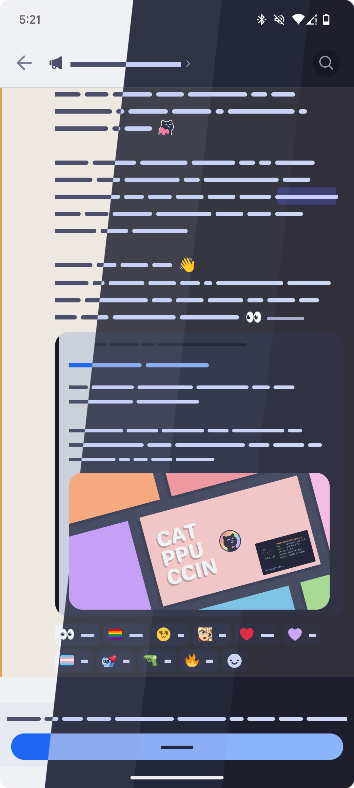
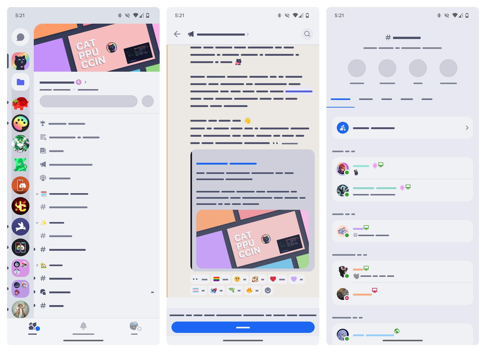
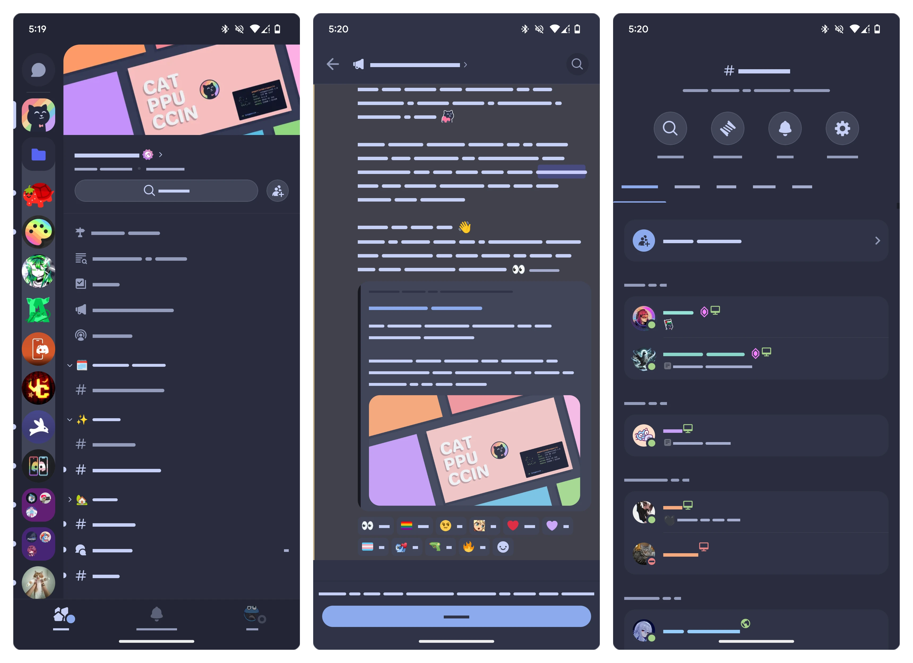
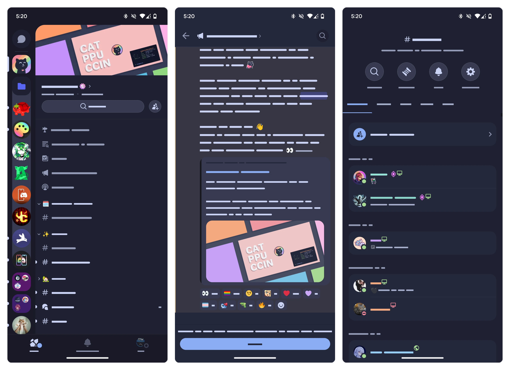
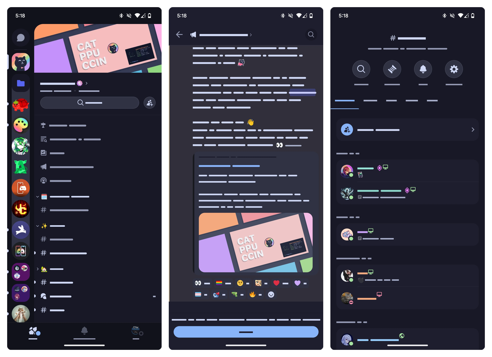

<h3 align="center">
  
 
 Catppuccin for <a href="https://github.com/vendetta-mod/Vendetta">Vendetta</a>, <a href="https://github.com/pyoncord/Bunny">Bunny</a> & <a href="https://github.com/enmity-mod/enmity">Enmity</a>
 
</h3>

 
 
 

  

## Previews

🌻 Latte

🪴 Frappé

🌺 Macchiato

🌿 Mocha

## Usage

> [!IMPORTANT]  
> This is the home for the shared theme format that [†
> Vendetta](https://github.com/vendetta-mod/Vendetta),
> [Enmity](https://github.com/enmity-mod/enmity) &
> [Bunny](https://github.com/pyoncord/Bunny) use.
> Vendetta is no longer included in the instructions below, as it has reached
> "End of Life."

1. Choose a flavor, and copy its link below:
   - **Latte**: <https://raw.githubusercontent.com/catppuccin/vendetta/main/latte.json>
   - **Frappe**: <https://raw.githubusercontent.com/catppuccin/vendetta/main/frappe.json>
   - **Macchiato**: <https://raw.githubusercontent.com/catppuccin/vendetta/main/macchiato.json>
   - **Mocha**: <https://raw.githubusercontent.com/catppuccin/vendetta/main/mocha.json>
2. Head to `Settings` > `Bunny` or `Enmity` > `Themes`
3. Paste the copied link and press `Install`
4. Select your theme and you're ready to go!

> [!NOTE]  
> Light mode can be used **only with Latte theme**.

### Themes+

Themes+ is required to theme some hard-coded elements (applied when themes+ is
loaded).

#### Installation
1. Copy `https://bunny.nexpid.xyz/themes-plus`
2. Head to `Settings` > `Bunny` > `Plugins` > `+`
3. Paste the copied link and press `Install`
> [!IMPORTANT]
> If you are using Enmity, install
> [VendettaCommpat](https://discord.com/channels/950850315601711176/1019645460589318165/1211473409154744350)
> plugin first. After doing so, follow this
> [guide](https://discord.com/channels/950850315601711176/1239393517151846412)
> as it loads Vendetta by default which is broken past Discord version 223.
> 

## 💝 Thanks to

- [riichi](https://github.com/riivx)
- [Cookie](https://github.com/Covkie)
- [Moodzz](https://github.com/Moodzz1)

&nbsp;

 

 Copyright &copy; 2021-present <a href="https://github.com/catppuccin" target="_blank">Catppuccin Org</a>

 

